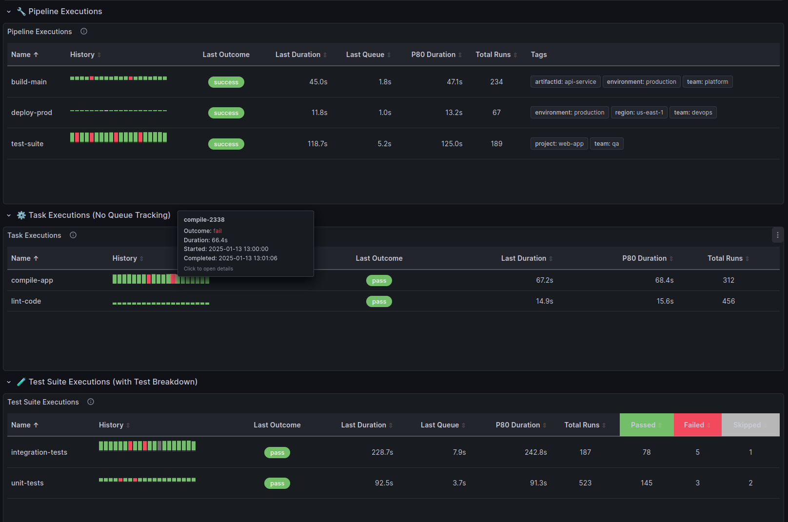

# CDviz Execution Table Panel

[](https://grafana.com)
[](https://github.com/cdviz-dev/cdviz-executiontable-panel/blob/main/LICENSE)
[](https://github.com/cdviz-dev/cdviz-executiontable-panel/releases)
[](https://github.com/cdviz-dev/cdviz-executiontable-panel/actions/workflows/ci.yml)

A Grafana panel plugin that displays execution data (pipelines, tasks, tests, etc.) in an interactive table with built-in bar chart history visualization. Perfect for monitoring CI/CD pipelines, test executions, and other time-series execution data using [CDEvents](https://cdevents.dev/).



## Features

- **Interactive execution table**: Display execution summaries with key metrics like success rate, duration, and last run status
- **Visual history bars**: Built-in sparkline-style bar charts showing execution history (success/failure/other states) over time
- **Customizable visualization**: Configure bar height, width, gap, and number of history items displayed
- **Duration percentiles**: Show configurable percentile values (P50, P80, P95) for duration analysis
- **Queue history**: Optional column to display queue duration patterns
- **CDEvents compatibility**: Designed to work seamlessly with CDEvents data from CI/CD pipelines
- **Responsive design**: Adapts to different panel sizes and dashboard layouts

## Requirements

- **Grafana**: Version 9.0.0 or higher
- **Data source**: Any Grafana data source that returns execution/pipeline data with the following fields:
  - Name/identifier
  - Status/result (success, failure, etc.)
  - Duration
  - Timestamp
  - Optional: Queue duration

## Getting started

### Installation

#### From GitHub Releases

1. Download the latest release from the [releases page](https://github.com/cdviz-dev/cdviz-executiontable-panel/releases)
2. Extract the archive into your Grafana plugins directory:
   - Default path: `/var/lib/grafana/plugins`
   - Or custom path specified in `grafana.ini` under `[paths] plugins`
3. Restart Grafana
4. Verify the plugin is installed by checking Grafana's plugin list

#### From Source

```bash
# Clone the repository
git clone https://github.com/cdviz-dev/cdviz-executiontable-panel.git
cd cdviz-executiontable-panel

# Install dependencies
yarn install

# Build the plugin
yarn build

# Create a symbolic link to your Grafana plugins directory
ln -s $(pwd) /var/lib/grafana/plugins/cdviz-executiontable-panel

# Restart Grafana
sudo systemctl restart grafana-server
```

### Configuration

1. **Add the panel**: In your Grafana dashboard, add a new panel and select "CDviz Execution Table" as the visualization type

2. **Configure your data source**: Query your execution data ensuring you have the necessary fields:
   - Execution name/identifier
   - Status (success, failure, etc.)
   - Duration values
   - Timestamps

3. **Customize the visualization**: Use the panel options to adjust:
   - **Max history items**: Number of execution bars to display (5-50, default: 20)
   - **Show queue history**: Toggle queue duration history column (default: true)
   - **Bar height**: Height of each history bar in pixels (10-40px, default: 20px)
   - **Bar width**: Width of each history bar in pixels (2-30px, default: 8px)
   - **Bar gap**: Spacing between bars in pixels (0-10px, default: 2px)
   - **Duration percentile**: Percentile value for duration display (1-99, default: 80 for P80)

## Usage

### Understanding the table columns

- **Name**: Execution identifier (pipeline, test, task name)
- **Summary**: Visual success/failure counts for recent executions
- **Last Duration**: Duration of the most recent execution
- **Last Result**: Status of the most recent execution (success/failure/etc.)
- **Last Run**: Timestamp of the most recent execution
- **P80 Duration** (or your configured percentile): Duration at the specified percentile
- **Total Runs**: Total number of recorded executions
- **History Bar**: Visual representation of execution history with color-coded status bars

### Color coding

- **Green**: Successful execution
- **Red**: Failed execution
- **Yellow/Orange**: Other states (queued, running, etc.)

## Development

### Prerequisites

- Node.js 22 or higher
- Yarn package manager
- [mise](https://mise.jdx.dev/) (optional, for task automation)

### Building the plugin

```bash
# Install dependencies
yarn install

# Build in development mode with watch
yarn dev

# Build for production
yarn build

# Run tests
yarn test:ci

# Run linter
yarn lint

# Fix linting issues
yarn lint:fix
```

### Using mise tasks

This project includes mise tasks for common operations:

```bash
# Install dependencies
mise run install:deps

# Run type checking
mise run typecheck

# Run linter
mise run lint

# Run tests
mise run test

# Build for production
mise run build

# Full CI pipeline (install, check, test, build)
mise run ci

# Package plugin as zip
mise run package
```

### Running the plugin locally

```bash
# Start Grafana dev server with Docker
yarn server

# The plugin will be available at http://localhost:3000
# Default credentials: admin/admin
```

### Running E2E tests

```bash
# Start Grafana server
yarn server

# In another terminal, run E2E tests
yarn e2e

# Test against a specific Grafana version
GRAFANA_VERSION=11.3.0 yarn server
```

## Contributing

We welcome contributions! Here's how you can help:

### Reporting bugs

If you find a bug, please [open an issue](https://github.com/cdviz-dev/cdviz-executiontable-panel/issues/new) with:

- A clear description of the issue
- Steps to reproduce
- Expected vs actual behavior
- Grafana version and plugin version
- Screenshots if applicable

### Feature requests

Have an idea for a new feature? [Open an issue](https://github.com/cdviz-dev/cdviz-executiontable-panel/issues/new) with:

- A clear description of the feature
- Use cases and benefits
- Any relevant examples or mockups

### Pull requests

1. Fork the repository
2. Create a feature branch (`git checkout -b feature/amazing-feature`)
3. Make your changes
4. Run tests and linting (`mise run ci`)
5. Commit your changes (`git commit -m 'Add amazing feature'`)
6. Push to your fork (`git push origin feature/amazing-feature`)
7. Open a pull request

Please ensure your code:

- Passes all tests and linting checks
- Follows the existing code style
- Includes tests for new functionality
- Updates documentation as needed

## License

This plugin is licensed under the [Apache License 2.0](https://github.com/cdviz-dev/cdviz-executiontable-panel/blob/main/LICENSE).

## Learn more

- [CDviz Project](https://cdviz.dev) - Learn more about CDviz and CDEvents
- [CDEvents Specification](https://cdevents.dev) - Open specification for CI/CD events
- [Grafana Panel Plugin Documentation](https://grafana.com/developers/plugin-tools/introduction/panel-plugins) - Official guide to building panel plugins
- [Grafana Plugin Development](https://grafana.com/developers/plugin-tools) - Tools and resources for plugin development
- [Plugin Signing](https://grafana.com/developers/plugin-tools/publish-a-plugin/sign-a-plugin) - How to sign and distribute your plugin

---

**Built with ❤️ by the [CDviz Team](https://cdviz.dev)**
